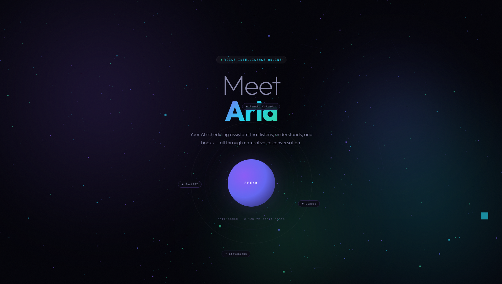
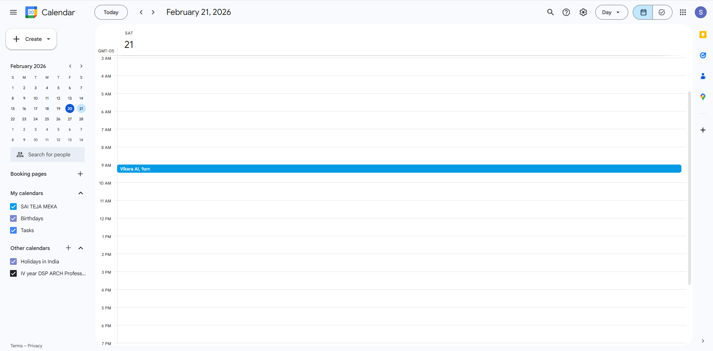
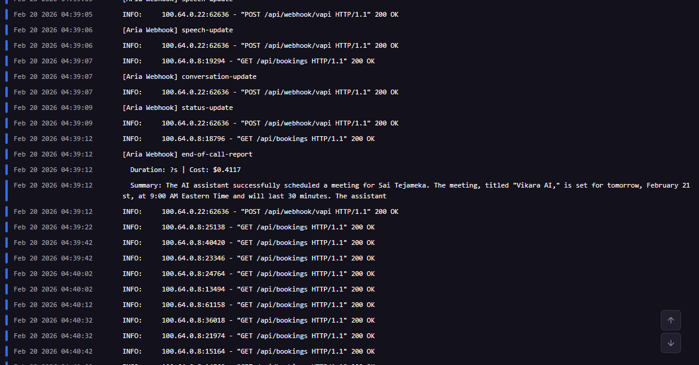

<p align="center">
  <h1 align="center">🎙️ Aria — Voice Scheduling Intelligence</h1>
  <p align="center">
    A real-time voice assistant that schedules Google Calendar events through natural conversation.
  </p>

  <p align="center">
    <a href="https://github.com/saiteja-gatadi-2002/vikara-voice-agent/blob/main/LICENSE">
      
    </a>
    
    
    
    
  </p>

  <p align="center">
    <a href="https://voiceagent-production-45c5.up.railway.app/"><strong>🌐 Live Demo</strong></a> •
    <a href="https://www.loom.com/share/501e045b6a844e06a37a9a4616699fa6"><strong>📹 Demo Video</strong></a> •
    <a href="#quick-start"><strong>🚀 Quick Start</strong></a>
  </p>
</p>

---

## 🧪 How to Test the Agent

1. Open the live demo: https://voiceagent-production-45c5.up.railway.app/
2. Click the glowing orb to start Aria.
3. Speak your name, desired date/time, and an optional title.
4. Wait for Aria to confirm, then approve the booking.
5. Check your connected Google Calendar for the newly created event.(For this demo, the calendar is a public shared demo calendar created for the demo purpose which you can access below to see the created events)

---

## 📅 Live Calendar Verification

Events booked through Aria appear in real time on our shared demo calendar:

👉 **[View Live Calendar](https://calendar.google.com/calendar/embed?src=aria.demo.agent%40gmail.com&ctz=America%2FNew_York)**

After speaking with Aria, open this link to see your event confirmed.

---

## 💬 What Aria Does

You click a button, speak naturally, and Aria books a real Google Calendar event. No forms, no typing, no friction.

**Example conversation:**
```
Aria:  Hi there! I'm Aria, your scheduling assistant. What's your name?
You:   Sai Teja.
Aria:  Nice to meet you, Sai Teja. When would you like to schedule a meeting?
You:   Tomorrow at 2 PM.
Aria:  Just to confirm, that's 2 PM Eastern time, correct?
You:   Yes.
Aria:  Would you like to give the meeting a title?
You:   Project kickoff.
Aria:  Since it's a kickoff, I'll set it for 60 minutes. Let me confirm — 
       Project Kickoff, tomorrow at 2 PM Eastern, for 60 minutes. Shall I book it?
You:   Go ahead.
Aria:  Done! Project Kickoff is on your calendar. Anything else?
```

Every detail there is real — conflict detection, timezone confirmation, duration inference from the title, and a confirmed Google Calendar event at the end.

---

## 🏗️ Architecture
```
┌─────────────┐    WebRTC     ┌─────────────┐    HTTPS Tools    ┌──────────────────┐    OAuth2    ┌─────────────┐
│   Browser   │ ────────────► │    VAPI      │ ────────────────► │   FastAPI Server  │ ──────────► │   Google    │
│   (Voice)   │ ◄──────────── │  (Orchestr.) │ ◄──────────────── │   (Tool Logic)    │ ◄────────── │  Calendar   │
└─────────────┘   TTS Audio   └─────────────┘   Tool Results    └──────────────────┘   Events    └─────────────┘
                                    │                                     │
                              Claude Sonnet                         SQLite Log
                              ElevenLabs Sarah                   Pydantic Validation
                              Scribe v1 STT                     Async Concurrency
```

### Tech Stack

| Layer | Technology | Why |
|-------|-----------|-----|
| **Voice & Orchestration** | VAPI | Handles WebRTC, turn-taking, STT/TTS routing — lets me focus on agent logic, not telephony |
| **Intelligence** | Claude Sonnet 4.5 (Anthropic) | Best reasoning quality for natural scheduling conversations |
| **Voice Synthesis** | ElevenLabs Sarah (Turbo v2.5) | Warm, professional, low-latency — not robotic |
| **Transcription** | ElevenLabs Scribe v1 | High accuracy for names and natural language time expressions |
| **Tool Server** | FastAPI (Python) | Async-ready, auto-docs, Pydantic validation out of the box |
| **Calendar** | Google Calendar API + OAuth2 | Real events on real calendars — not a mock |
| **Booking Log** | SQLite | Lightweight persistent record of all scheduled events |
| **Deployment** | Railway + Docker | One-command deploy with health checks |
| **Frontend** | Three.js + Vanilla JS | Immersive 3D particle background with live transcript feed |

**Key design decision:** VAPI server-url tools execute synchronously — the LLM waits for the calendar response before speaking. No race conditions, no "I'll check and get back to you." The agent knows immediately whether the booking succeeded.

---

## ✨ Features

### Core Capabilities
- **Natural language scheduling** — "next Tuesday at 3", "tomorrow afternoon", "in two days around noon"
- **Google Calendar integration** — real OAuth2 flow, real events, real conflict detection
- **User confirmation** — Aria never books without explicit approval

### Intelligence Layer
- **Conflict detection** — checks calendar before booking, suggests alternatives if busy
- **Smart slot discovery** — "What's available?" returns 3 open time slots, filterable by morning/afternoon/evening
- **Duration inference** — "quick sync" → 15 min, "project kickoff" → 60 min, "meeting" → 30 min
- **Timezone awareness** — confirms timezone with the caller before every booking
- **Name handling** — asks for spelling if transcription is garbled; handles diverse names naturally
- **Error recovery** — silent retry on calendar API failures, graceful fallback messaging

### Production Quality
- **Modular codebase** — separated into config, models, routes, services, and utilities
- **Pydantic validation** — all tool call inputs are typed and validated
- **Versioned API** — tool endpoints at `/tools/api/v1/{tool_name}`
- **Async-safe** — sync Google API calls wrapped in `asyncio.to_thread()` to prevent event loop blocking
- **SQLite booking log** — every successful booking recorded with full metadata
- **Docker Compose** — single-command container deployment with health checks
- **Auto token refresh** — Google credentials refresh automatically on expiry

### Frontend Experience
- **Three.js particle network** — interactive background with mouse-reactive camera and connecting lines
- **Glowing orb interface** — animated call button with pulsing rings during active calls
- **Live transcript feed** — real-time conversation display with tool call indicators
- **Recent bookings sidebar** — auto-refreshing feed with audio notification on new bookings
- **Architecture diagram** — animated node flow showing the full system pipeline
- **Scroll-reveal animations** — sections animate in as you scroll

### 📅 Google Calendar Integration

Aria connects directly to the Google Calendar API to create real events from natural voice conversations.

Uses a full OAuth 2.0 flow so each user securely connects their own Google Calendar; access and refresh tokens are stored server-side and auto-refreshed to keep scheduling seamless.
​

All calendar logic lives in a dedicated calendar_service module, which handles:

OAuth token management and refresh

Event creation with RFC3339, timezone-aware timestamps

Conflict checks using bounded time-window queries

Availability lookups over dynamic ranges

Before booking, Aria always checks the user’s primary calendar for conflicts; if a clash is found, structured metadata about overlapping events is returned so the agent can suggest alternatives instead of double-booking.

Natural-language inputs like “tomorrow at 3 PM” are parsed into timezone-aware ISO 8601/RFC3339 strings and converted to UTC before hitting Google, preventing malformed requests and time-zone bugs.

To keep the FastAPI app responsive, synchronous Google client calls run inside asyncio.to_thread(), which keeps the event loop non-blocking while still using the official Google API client.

A /api/direct/schedule endpoint lets you call the calendar logic directly (without VAPI) for easy testing and debugging of the integration.

This design makes the calendar layer secure (OAuth-based), reliable (auto token refresh), async-safe, and ready for multi-tenant expansion.

---
## 📸 Screenshots – Event Creation

### 1. Voice agent confirmation


### 2. Conversation and Booking sections 


### 3. Booking section


### 4. Google Calendar event


### 5. Booking log / server view



## 📁 Project Structure
```
vikara-voice-agent/
├── app/
│   ├── main.py              # App factory — wires all routers
│   ├── config.py            # Centralized env var management
│   ├── models.py            # Pydantic schemas for all I/O
│   ├── database.py          # SQLite booking log
│   ├── calendar_service.py  # Google Calendar OAuth + CRUD
│   ├── datetime_utils.py    # Natural language date/time parsing
│   ├── vapi_utils.py        # VAPI payload helpers
│   └── routes/
│       ├── tools.py         # /tools/api/v1/* — VAPI tool endpoints
│       ├── auth.py          # /auth/* — Google OAuth flow
│       ├── pages.py         # Landing page, health, bookings API
│       └── webhooks.py      # /api/webhook/* — VAPI call events
├── frontend/
│   └── index.html           # Immersive 3D frontend
├── setup_vapi_assistant.py  # Programmatic VAPI agent creation/updates
├── docker-compose.yml
├── Dockerfile
├── Procfile
├── requirements.txt
├── .env.example
└── README.md
```

---

## 🚀 Quick Start

### Prerequisites
- Python 3.10+
- Google Cloud project with Calendar API enabled
- VAPI account ([dashboard.vapi.ai](https://dashboard.vapi.ai))

### Installation
```bash
git clone https://github.com/Sai-Teja-Meka/Voice_Agent
cd Voice-Agent
python -m venv venv
source venv/bin/activate  # Windows: venv\Scripts\activate
pip install -r requirements.txt
cp .env.example .env
# Fill in your credentials in .env
```

### Run Locally
```bash
uvicorn app.main:app --reload --port 8000
```

Visit `http://localhost:8000/auth/login` to connect Google Calendar, then:
```bash
python setup_vapi_assistant.py
```

### Deploy
```bash
# Docker
docker compose up --build

# Railway
railway login && railway up
```

Set `SERVER_URL`, `GOOGLE_REDIRECT_URI`, and all API keys in your deployment environment.

---

## 📊 API Endpoints

| Method | Path | Purpose |
|--------|------|---------|
| `GET` | `/` | 3D frontend with voice widget |
| `GET` | `/health` | Health check |
| `GET` | `/auth/login` | Start Google OAuth flow |
| `GET` | `/auth/callback` | OAuth callback handler |
| `POST` | `/tools/api/v1/schedule-event` | Create calendar event (VAPI tool) |
| `POST` | `/tools/api/v1/check-availability` | Check time slot availability (VAPI tool) |
| `POST` | `/tools/api/v1/available-slots` | Find open slots for a date (VAPI tool) |
| `GET` | `/api/bookings` | Recent bookings feed |
| `POST` | `/api/webhook/vapi` | VAPI call lifecycle events |
| `POST` | `/api/direct/schedule` | Direct scheduling (testing, no VAPI) |
| `GET` | `/docs` | Auto-generated API documentation |

---

## 🗺️ Production Roadmap

If this were going to production, here's what I'd build next:

### Multi-Tenancy
Each user connects their own Google Calendar via OAuth. Credentials stored in Postgres, looked up per caller via phone number or email. The current architecture supports this with minimal changes to the tool endpoints.

### Enhanced Features
- **Rescheduling & cancellation** — Aria detects intent ("move my 3 PM to 4") and handles event updates, not just creation
- **Recurring events** — "Schedule this every Tuesday at 10 AM" with Google Calendar recurrence rules
- **Email confirmations** — post-booking email summary via SendGrid

### Infrastructure
- **Postgres** — replace SQLite with Postgres for concurrent write safety and production durability. Add to the Docker Compose stack
- **YAML configuration** — externalize tool definitions and agent config into YAML files instead of Python dicts for easier non-developer editing
- **Test suite** — unit tests for date parsing edge cases, integration tests for the calendar flow, and end-to-end voice test scripts

### Analytics
- Call duration tracking
- Booking success rate monitoring
- Most common time slot analysis
- Transcript sentiment analysis

---

## 🤝 Contributing

Contributions are welcome! Please feel free to submit a Pull Request.

---

## 📄 License

This project is licensed under the MIT License - see the [LICENSE](LICENSE) file for details.

---

## 👤 Author

**Sai Teja Meka**  
AI Product Engineer | Voice AI Specialist

- **GitHub**: [@Sai-Teja-Meka](https://github.com/Sai-Teja-Meka)
- **LinkedIn**: [sai-teja-meka](https://www.linkedin.com/in/sai-teja-meka-b336211b6)
- **Email**: saitejameka45usa@gmail.com

---

<p align="center">
  <strong>🎙️ Built with voice-first AI thinking</strong>
</p>

<p align="center">
  <a href=https://github.com/Sai-Teja-Meka/Voice_Agent
  target="_blank">⭐ Star this repo</a> • 
  <a href="https://voiceagent-production-45c5.up.railway.app/" target="_blank">🌐 Try the demo</a>
</p>
